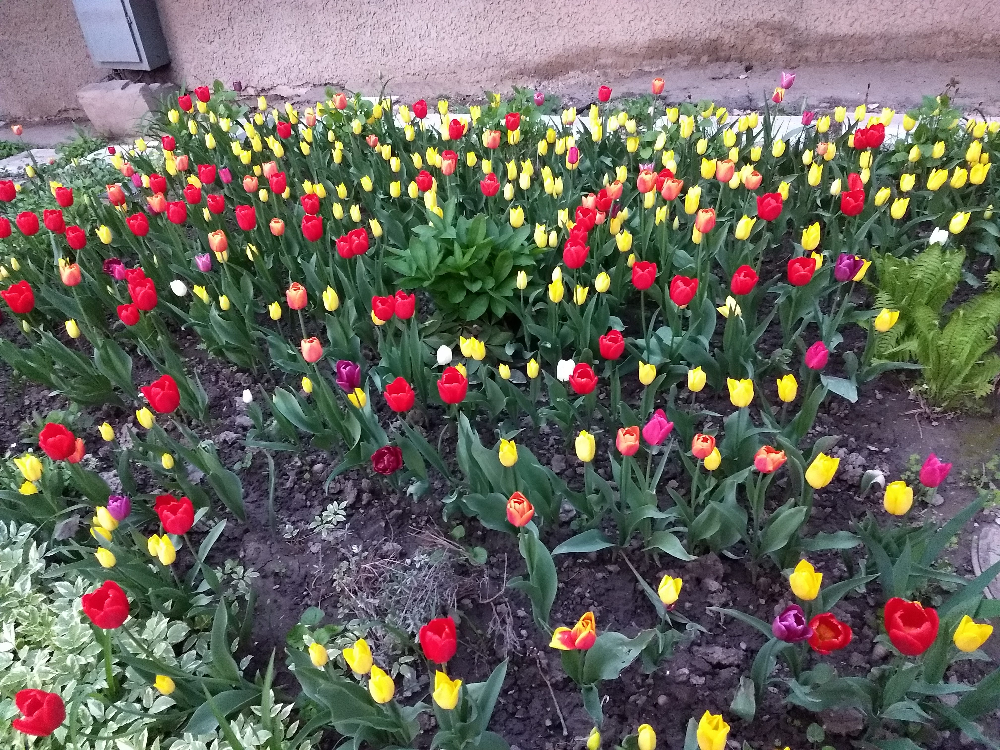

<!DOCTYPE html>
<html lang="ru">
<head>
    <meta charset="UTF-8">
    <title>Мой первый сайт (с цветами+CSS вручную)</title>
    
</head>
<body>
    <h2>Добро пожаловать на мой сайт!</h2>
    
Это мой первый сайт, созданный с помощью HTML и CSS для стилизации.
 

 
Об HTML я узнал в 2023 году, когда изучал возможность перехода в IT. Изучая описания языков программирования, я увидел рекомендацию, что можно начать с программирования в HTML.
 

 
Спустя более, чем через год, я попробовал. Мне пока нравится.

Сегодня утром в 11:09, 18.01.2024 я научился использовать тег (''p../p''), используя его для переноса абзацев, попутно узнав, что если отображать тег с помощью горизонтальных галочек, то ничего не отобразиться, поэтому пришлось использовать кавычки и круглые скобки. 

    

<a href="https://www.youtube.com/">Посетите мой любимый сайт</a>

Это мой любимый сайт уже очень долгое время, по-моему с 2016-2017 гг.
 

<a href="https://www.linkedin.com/">Однако, кроме него есть ещё этот </a>

  

 Огромная благодарность материалам сайтов:

<a href="https://sky.pro/wiki/html/kak-sozdat-prostoj-sajt-na-html-v-bloknote/">
"Как создать простой сайт на HTML в блокноте."</a>

<a href="https://uguide.ru/tablica-osnovnykh-tegov-html-s-primerami">
"Таблица основных тегов html с примерами."</a>

 Ссылка ниже позже пригодится:

<a href="https://dzen.ru/a/YKN_4Xm-fiF0C0c3"> "Как опубликовать сайт в интернете бесплатно."</a>

 Пробуем вставить картинку (31.05.2025): 

<figure>

 

<figcaption>
Цветы жёлтые и красные в огороде.
</figcaption>
</figure>

 Спасибо данной инструкции: 

 <a href="https://developer.mozilla.org/ru/docs/Learn_web_development/Core/Structuring_content/HTML_images"> "Изображения в HTML."</a>

Есть также версия сайта, сделанного с помощью Copilot:

 Всем успешного дня! 

</body>
</html>
